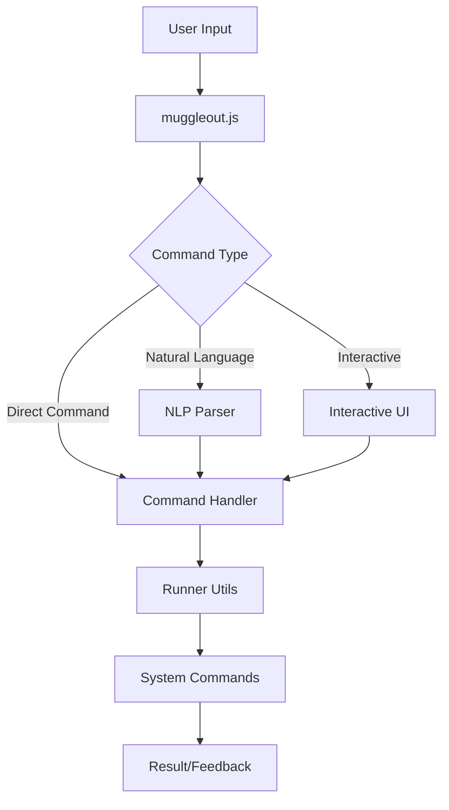

# 🏗️ Muggleout Architecture Documentation

## 📋 Overview

Muggleout는 비개발자를 위한 터미널 환경 설정 도구로, Node.js 기반의 대화형 CLI 애플리케이션입니다.

## 🎯 Core Features

1. **자연어 명령 처리** - "터미널 예쁘게 만들어줘" 같은 자연스러운 명령 이해
2. **대화형 메뉴** - inquirer 기반의 직관적인 메뉴 시스템
3. **도구 설치 자동화** - Homebrew, iTerm2, Oh My Zsh 등 자동 설치
4. **상태 감지** - 설치된 도구 자동 감지 및 표시
5. **플랫폼 체크** - macOS 환경 감지 및 최적화

## 📁 Project Structure

```
muggleout/
├── bin/
│   └── muggleout.js          # Entry point, iTerm2 체크
├── src/
│   ├── commands/             # 명령어 구현
│   │   ├── install.js        # 도구 설치 로직
│   │   ├── status.js         # 상태 확인
│   │   ├── doctor.js         # 시스템 진단
│   │   └── fix.js            # 문제 해결
│   ├── parsers/
│   │   └── natural-language.js # 자연어 처리
│   ├── ui/
│   │   └── interactive.js    # 대화형 인터페이스
│   └── utils/
│       ├── config.js         # 설정 관리
│       ├── runner.js         # 명령어 실행
│       ├── system-check.js   # 시스템 체크
│       └── terminal-check.js # 터미널 환경 체크
├── package.json
└── README.md
```

## 🔧 Key Components

### 1. Entry Point (`bin/muggleout.js`)
- iTerm2 사용 권장 메시지 표시
- Commander.js로 명령어 파싱
- 서브커맨드 라우팅 (install, status, doctor 등)

### 2. Natural Language Parser (`parsers/natural-language.js`)
```javascript
// 키워드 매핑 예시
const keywords = {
  install: ['설치', 'install', '깔아줘'],
  tools: {
    'claude': ['claude', '클로드'],
    'iterm': ['터미널', 'iterm']
  }
}
```

### 3. Interactive UI (`ui/interactive.js`)
- Inquirer.js 기반 메뉴 시스템
- 설치 상태 실시간 표시
- CLI 사용법 가이드 통합

### 4. Installation Manager (`commands/install.js`)
```javascript
const installConfigs = {
  'homebrew': {
    name: 'Homebrew',
    check: () => commandExists('brew'),
    install: async () => { /* 설치 로직 */ }
  },
  // ... 다른 도구들
}
```

### 5. Command Runner (`utils/runner.js`)
- execa 라이브러리로 안전한 명령 실행
- 홈 디렉토리 경로 확장 (`~` → `/Users/username`)
- 에러 처리 및 exit code 관리

## 🔄 Data Flow



## 🗃️ State Management

### Configuration Storage
- 위치: `~/.muggleout/config.json`
- 내용: 설치된 도구 기록, 사용자 설정

### Tool Detection
```javascript
// 실시간 감지 예시
checkToolInstalled('test -d /Applications/iTerm.app')
checkToolInstalled('brew')
```

## 🌐 Dependencies

### Core Dependencies
- **commander**: CLI 명령어 파싱
- **inquirer**: 대화형 프롬프트
- **chalk**: 터미널 색상
- **boxen**: 박스 UI
- **ora**: 로딩 스피너
- **execa**: 안전한 명령 실행

### Dev Dependencies
- **eslint**: 코드 품질
- **prettier**: 코드 포맷팅

## 🚀 Installation Flow

1. **Prerequisites Check**
   - macOS 버전 확인
   - 프로세서 타입 감지 (Intel/Apple Silicon)

2. **Tool Installation**
   - 의존성 체크 (예: Node.js는 Homebrew 필요)
   - 대화형 설치 프로세스
   - 설치 후 작업 (PATH 설정 등)

3. **Post-Install**
   - 설정 파일 업데이트
   - 성공 메시지 및 다음 단계 안내

## 🔒 Security Considerations

1. **명령 실행 보안**
   - 사용자 입력 직접 실행 금지
   - 미리 정의된 명령만 실행
   - sudo 권한 최소화

2. **파일 시스템 접근**
   - 홈 디렉토리 내에서만 작업
   - 시스템 파일 수정 금지

## 🎨 UI/UX Design Principles

1. **초보자 친화적**
   - 전문 용어 최소화
   - 단계별 안내
   - 시각적 피드백 (색상, 이모지)

2. **에러 처리**
   - 명확한 에러 메시지
   - 해결 방법 제시
   - 복구 옵션 제공

## 📊 Performance Considerations

1. **병렬 처리**
   - Promise.all()로 동시 상태 체크
   - 독립적인 작업 병렬 실행

2. **캐싱**
   - 설치 상태 캐싱
   - 반복적인 체크 최소화

## 🔄 Future Enhancements

1. **다국어 지원**
   - i18n 라이브러리 통합
   - 언어별 자연어 처리

2. **플러그인 시스템**
   - 사용자 정의 도구 추가
   - 커뮤니티 확장

3. **업데이트 시스템**
   - 자동 업데이트 체크
   - 도구별 버전 관리

## 🐛 Known Issues

1. **경로 감지 문제**
   - nvm 환경에서 Node.js 경로
   - 사용자별 설치 경로 차이

2. **플랫폼 제한**
   - 현재 macOS 전용
   - Windows/Linux 지원 필요

## 📚 Testing Strategy

1. **Unit Tests** (계획)
   - 파서 로직 테스트
   - 설치 설정 검증

2. **Integration Tests**
   - Docker 환경 테스트
   - Dev Container 테스트

3. **Manual Testing**
   - 실제 macOS 환경
   - 다양한 터미널 환경

---

Last Updated: 2024-01-26